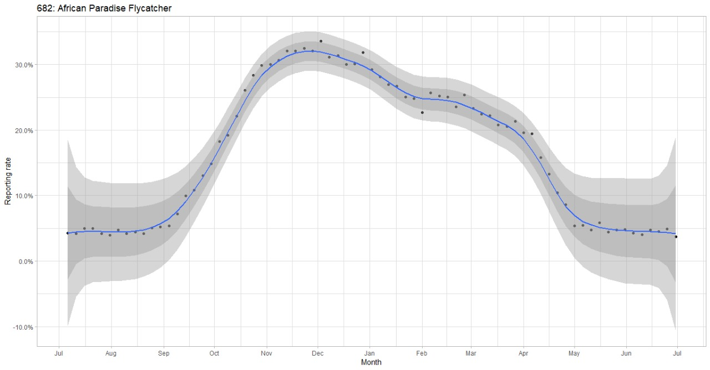

## The Kenya Bird Map

*This will eventually change to the Africa Bird Map.*

The Kenya Bird Map project aims to map the current distribution of all of Kenya’s bird species and describe their status with the help of valued input from Citizen Scientists – volunteer members of the public who are keen to contribute through going birding and submitting their observations to the project. By pooling the efforts of many Citizen Scientist birders, Kenya Bird Map will tell the story of changing bird distributions and abundance - and in so doing provide a powerful tool for conservation.


This package is an attempt to make life easier for the researchers and citizen scientists interacting with the Africa Bird Map's data. Some examples on how to use the package are given below.


### Example 1 : Calculate the reporting rate for a species


First you need to extract data from AFB. This is done using an API call. However, this is temporary solution and must be changed. 
```r
# download data for the African Paradise Flycatcher
raw_data <- extract_data(username = "dclarance@gmail.com" ,user_id = 40664, password = "xxxxx", species_id = 682)

```

Then you can run the reporting rate function with the conditions you like 

```r 
# get the reporting rate for African Paradise Flycatcher in Nairobi National Park
reporting_rate(df = raw_data, species_id = 682, start_date = '1970-01-01', end_date = Sys.Date(), pentad_id = '0120-3650')

```

### Example 2: Graph the occurence of a species and fit the Underhill smoother


First we need to create the dataset with the smoothened values
```r 
# get the underhill smoothened data for African Paradise Flycatcher (across Africa)
analysis_df <- underhill_smoother(raw_data = raw_data, species_id = 682, start_month = 7, pentade_window = 3, first_pentade = 1, last_pentade = 73)

```

Once that's done, we'll just need to plug in those values into the plotting function. 

```r 
# plot the curves
underhill_curves(underhill_smoother = analysis_df, species_id = 682, species_name = "African Paradise Flycatcher")
```


